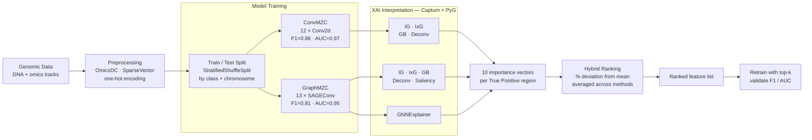

# OmiXAI

**OmiXAI** is an ensemble pipeline for gradient-based feature attribution in deep learning models trained on genomic and epigenomic data. It combines multiple attribution methods across CNN and GNN architectures and aggregates their outputs into a single ranked feature list via hybrid ranking.

Preprint: [bioRxiv 2025.04.28.651097](https://doi.org/10.1101/2025.04.28.651097)

---

## How it works



---

## Supported attribution methods

| Method | CNN | GNN | Library |
|--------|:---:|:---:|---------|
| Integrated Gradients (IG) | ✓ | ✓ | Captum |
| InputXGradient (IxG) | ✓ | ✓ | Captum |
| Guided Backpropagation (GB) | ✓ | ✓ | Captum |
| Deconvolution (Deconv) | ✓ | ✓ | Captum |
| Saliency | — | ✓ | Captum |
| GNNExplainer | — | ✓ | PyG |

---

## Data

Genomic data: [vladislareon/z_dna](https://github.com/vladislareon/z_dna)

Feature serialisation uses [SparseVector](https://github.com/Nazar1997/Sparse_vector) — clone it and add to `PYTHONPATH` (see cluster setup below).

---

## Installation

### HSE HPC cluster (recommended)

```bash
# 1. Load the pre-built GPU environment — includes torch 2.1.2+cu121,
#    torch_geometric, captum, numpy, pandas, scikit-learn
module load Python/Google_Colab_GPU_2024

# 2. Clone the repo
git clone -b reviewer-revision https://github.com/aameliig/OmiXAI.git ~/OmiXAI

# 3. SparseVector — not a pip package, clone alongside data
#    (skip if already present in your data directory)
git clone https://github.com/Nazar1997/Sparse_vector.git ~/DNA/Sparse_vector
```

### Local / other environments

```bash
# PyTorch — match to your CUDA version
pip install torch==2.1.2 --index-url https://download.pytorch.org/whl/cu121

# PyTorch Geometric scatter/sparse (must match torch + CUDA)
pip install torch-scatter torch-sparse torch-cluster \
    -f https://data.pyg.org/whl/torch-2.1.2+cu121.html

pip install -r requirements.txt
```

---

## Running on the cluster

```bash
ssh -p 2222 aoborevskiy@cluster.hpc.hse.ru
cd ~/OmiXAI

# Step 1 — interpretation (~4–8 h, 1 GPU). Default METHOD=hybrid.
sbatch scripts/omixai.slurm

# Monitor
squeue -u $USER
tail -f logs/omixai_<JOBID>.out

# Step 2 — permutation feature importance (Reviewer 1 comparison).
# Same runner, PFI format. Parallelises across GPUs in pure Python.
METHOD=pfi sbatch scripts/omixai.slurm
#   or directly:
#   python scripts/run_interpret.py --model "$WEIGHTS" --data_dir "$DATA_DIR" \
#       --method pfi --out_dir results/pfi_dl/

# Step 3 — retrain with top-k features (~6–8 h, 1 GPU).
# Run after the matching interpretation finishes.
python scripts/run_retrain.py --data_dir "$DATA_DIR" \
    --ranking results/omixai_ranking.csv          # OmiXAI arm
python scripts/run_retrain.py --data_dir "$DATA_DIR" \
    --pfi_scores results/pfi_dl/pfi_dl_scores.npy \
    --feature_names results/feature_names.json    # PFI arm
```

Results are written to `results/`:

| File | Contents |
|------|----------|
| `omixai_ranking.csv` | Hybrid-ranked feature list |
| `omixai_gnn_scores.npy` | Raw attribution scores per method |
| `feature_names.json` | Canonical feature order (shared by all scripts) |
| `pfi_dl/pfi_dl_scores.npy` | DL permutation importance scores |
| `retrain_omixai.csv` / `retrain_pfi.csv` | F1 / AUC at top-k per arm |

---

## Quick start (Python API)

```python
from omixai import OmiXAI

# Pass an already-trained model. model_type is auto-detected from layer types
# (Conv2d → cnn, MessagePassing → gnn). No feature counts are needed: the input
# width is read from the data, and the number of leading channels to skip is
# inferred as F - len(feature_names) at ranking time.
pipeline = OmiXAI(model=graph_model)

# Hybrid ensemble (default). Interpret train TPs only — test set stays sealed.
pipeline.interpret(train_loader, method="hybrid", width=100)
rankings = pipeline.rank_features(feature_names=feature_list)   # DNA channels dropped here
print(rankings.head(20))

# Permutation feature importance (GNN), parallel across GPUs in pure Python.
pipeline.interpret(train_loader, method="pfi", pfi_batch_size=64)
pfi_rank = pipeline.rank_features(feature_names=feature_list)
```

Non-genomic use: just pass `feature_names` covering every channel — then nothing
is skipped (`skip = F - len(feature_names) = 0`).

---

## Repository structure

```
OmiXAI/
├── omixai/
│   ├── __init__.py
│   ├── pipeline.py          # OmiXAI class — interpret(method=...) + rank_features()
│   ├── models/
│   │   ├── cnn.py           # ConvMZC
│   │   └── gnn.py           # GraphMZC
│   ├── data/
│   │   ├── dataset.py       # GenomicDataset + split (CNN)
│   │   ├── graph_dataset.py # GraphGenomicDataset + stratified_split_intervals (GNN)
│   │   └── genome.py        # genome loading + one-file joblib cache
│   ├── xai/
│   │   └── pfi.py           # batched, multi-GPU permutation feature importance
│   └── training/
│       ├── train_cnn.py     # training loop + metrics
│       ├── train_gnn.py
│       └── retrain.py       # retrain_topk: top-k feature-reduction experiment
├── scripts/                 # thin runners (no logic) + SLURM wrappers
│   ├── run_interpret.py     # interpretation runner (--method hybrid|pfi)
│   ├── run_retrain.py       # top-k retraining runner
│   ├── compare_old_new_ranking.py
│   ├── genome_cache.py      # back-compat shim → omixai.data.genome
│   └── omixai.slurm         # SLURM job (METHOD=hybrid|pfi)
├── notebooks/
├── results/
├── README.md
└── requirements.txt
```

---

## Citation

```bibtex
@article{alaeva2025omixai,
  title   = {OmiXAI: An Ensemble XAI Pipeline for Interpretable
             Deep Learning in Omics Data},
  author  = {Alaeva, Ameliia and Lapteva, Anna and Mikhaylovskaya, Natalya
             and Malkov, Vladislav and Herbert, Alan
             and Borevskiy, Andrey and Poptsova, Maria},
  journal = {Briefings in Bioinformatics},
  year    = {2025},
  doi     = {10.1101/2025.04.28.651097}
}
```
