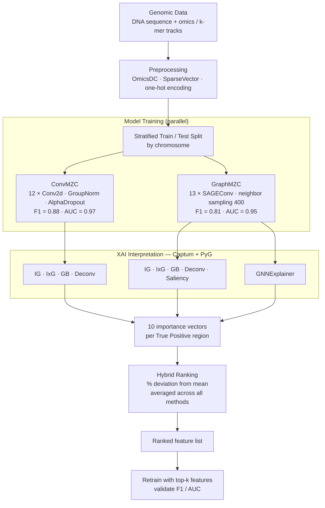

# OmiXAI

**OmiXAI** is an ensemble pipeline for gradient-based feature attribution in deep learning models trained on genomic and epigenomic data. It combines multiple attribution methods across CNN and GNN architectures and aggregates their outputs into a single ranked feature list via hybrid ranking.

Preprint: [bioRxiv 2025.04.28.651097](https://doi.org/10.1101/2025.04.28.651097)

---

## How it works



---

## Data

Genomic data: [vladislareon/z_dna](https://github.com/vladislareon/z_dna)

The `.pkl` files use [SparseVector](https://github.com/Nazar1997/Sparse_vector) format — included in `requirements.txt`, installed automatically.

---

## Installation

```bash
# 1. PyTorch — match to your CUDA version
pip install torch==2.1.2 torchvision==0.16.2 --index-url https://download.pytorch.org/whl/cu118

# 2. PyTorch Geometric scatter/sparse binaries (must match torch + CUDA)
pip install torch-scatter torch-sparse torch-cluster \
    -f https://data.pyg.org/whl/torch-2.1.2+cu118.html

# 3. Everything else (includes SparseVector)
pip install -r requirements.txt
```

---

## Quick start

```python
from omixai import OmiXAI

# accepts any trained ConvMZC or GraphMZC model
pipeline = OmiXAI(model=graph_model, model_type='gnn', n_features=1950)

# run attribution methods; pass both loaders to use all True Positives
attributions = pipeline.interpret(train_loader, test_loader, width=100)

# hybrid ranking — DataFrame sorted by mean percentage deviation
rankings = pipeline.rank_features(feature_names=feature_list)
print(rankings.head(20))
```

Run a subset of methods:

```python
attributions = pipeline.interpret(test_loader, methods=['IG', 'IxG'], width=100)
```

---

## Permutation Feature Importance

PFI is included for benchmarking against hybrid ranking:

```python
from omixai.pfi import compute_pfi_gnn, compare_rankings

pfi_scores, base_f1 = compute_pfi_gnn(
    model=graph_model,
    loader=test_loader,
    n_features=1950,
    n_repeats=5,
)

stats = compare_rankings(omixai_scores, pfi_scores, top_k_values=(50, 100, 300, 500))
print(f"Spearman ρ = {stats['spearman_rho']:.3f}  (p = {stats['spearman_pval']:.2e})")
```

---

## Repository structure

```
OmiXAI/
├── omixai/
│   ├── pipeline.py          # OmiXAI class — interpret() and rank_features()
│   └── pfi.py               # permutation feature importance + ranking comparison
├── models/
│   ├── cnn.py               # ConvMZC architecture
│   └── gnn.py               # GraphMZC architecture
├── data/
│   ├── dataset.py           # Dataset class + stratified train/test split (CNN)
│   └── graph_dataset.py     # GraphDataset + edge construction (GNN)
├── training/
│   ├── train_cnn.py         # training loop, metrics, plotting (CNN)
│   └── train_gnn.py         # training loop, metrics, plotting (GNN)
├── notebooks/               # worked examples (interpretation, RRA)
├── README.md
└── requirements.txt
```

---

## Supported attribution methods

| Method | CNN | GNN | Library |
|--------|:---:|:---:|---------|
| Integrated Gradients (IG) | ✓ | ✓ | Captum |
| InputXGradient (IxG) | ✓ | ✓ | Captum |
| Guided Backpropagation (GB) | ✓ | ✓ | Captum |
| Deconvolution (Deconv) | ✓ | ✓ | Captum |
| Saliency | — | ✓ | Captum |
| GNNExplainer | — | ✓ | PyG |

---

## Citation

```bibtex
@article{alaeva2025omixai,
  title   = {OmiXAI: An Ensemble XAI Pipeline for Interpretable
             Deep Learning in Omics Data},
  author  = {Alaeva, Ameliia and Lapteva, Anna and Mikhaylovskaya, Natalya
             and Malkov, Vladislav and Herbert, Alan
             and Borevskiy, Andrey and Poptsova, Maria},
  journal = {Briefings in Bioinformatics},
  year    = {2025},
  doi     = {10.1101/2025.04.28.651097}
}
```
