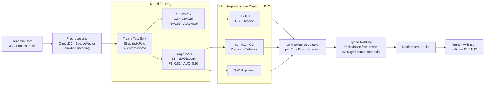

# OmiXAI

**OmiXAI** is an ensemble pipeline for gradient-based feature attribution in deep learning models trained on genomic and epigenomic data. It combines multiple attribution methods across CNN and GNN architectures and aggregates their outputs into a single ranked feature list via hybrid ranking.

Preprint: [bioRxiv 2025.04.28.651097](https://doi.org/10.1101/2025.04.28.651097)

---

## How it works



---

## Supported attribution methods

| Method | CNN | GNN | Library |
|--------|:---:|:---:|---------|
| Integrated Gradients (IG) | ✓ | ✓ | Captum |
| InputXGradient (IxG) | ✓ | ✓ | Captum |
| Guided Backpropagation (GB) | ✓ | ✓ | Captum |
| Deconvolution (Deconv) | ✓ | ✓ | Captum |
| Saliency | — | ✓ | Captum |
| GNNExplainer | — | ✓ | PyG |

---

## Data

Genomic data: [vladislareon/z_dna](https://github.com/vladislareon/z_dna)

Feature serialisation uses [SparseVector](https://github.com/Nazar1997/Sparse_vector) — clone it and add to `PYTHONPATH` (see cluster setup below).

---

## Installation

### HSE HPC cluster (recommended)

```bash
# 1. Load the pre-built GPU environment — includes torch 2.1.2+cu121,
#    torch_geometric, captum, numpy, pandas, scikit-learn
module load Python/Google_Colab_GPU_2024

# 2. Clone the repo
git clone -b reviewer-revision https://github.com/aameliig/OmiXAI.git ~/OmiXAI

# 3. SparseVector — not a pip package, clone alongside data
#    (skip if already present in your data directory)
git clone https://github.com/Nazar1997/Sparse_vector.git ~/DNA/Sparse_vector
```

### Local / other environments

```bash
# PyTorch — match to your CUDA version
pip install torch==2.1.2 --index-url https://download.pytorch.org/whl/cu121

# PyTorch Geometric scatter/sparse (must match torch + CUDA)
pip install torch-scatter torch-sparse torch-cluster \
    -f https://data.pyg.org/whl/torch-2.1.2+cu121.html

pip install -r requirements.txt
```

---

## Running on the cluster

```bash
ssh -p 2222 aoborevskiy@cluster.hpc.hse.ru
cd ~/OmiXAI

# Step 1 — OmiXAI interpretation (~4–8 h, 1 GPU)
sbatch scripts/omixai.slurm

# Monitor
squeue -u $USER
tail -f logs/omixai_<JOBID>.out

# Step 2 — RF-based PFI comparison (~30 min, CPU)
# Run after step 1 completes (needs results/omixai_ranking.csv)
sbatch scripts/pfi.slurm

# Step 3 — Retrain with top-k features (~6–8 h, 1 GPU)
# Run after step 1 completes
sbatch scripts/retrain_topk.slurm
```

Results are written to `results/`:

| File | Contents |
|------|----------|
| `omixai_ranking.csv` | Hybrid-ranked feature list |
| `omixai_gnn_scores.npy` | Raw attribution scores per method |
| `feature_matrix_flat.npy` | Per-interval mean features (for RF-PFI) |
| `pfi_rf_scores.npy` | RF permutation importance scores |
| `retrain_table.csv` | F1 / AUC at top-k for OmiXAI and PFI |

---

## Quick start (Python API)

```python
from omixai import OmiXAI

# model_type is auto-detected from layer types (Conv2d → cnn, MessagePassing → gnn)
pipeline = OmiXAI(
    model=graph_model,
    n_features=1946,          # number of omics features
    n_skip_features=4,        # leading channels to skip (4 = one-hot DNA A/T/G/C)
)

# interpret train TPs only — test set stays sealed for validation
attributions = pipeline.interpret(train_loader, width=100)

# hybrid ranking
rankings = pipeline.rank_features(feature_names=feature_list)
print(rankings.head(20))
```

Non-genomic use (no DNA channels to skip):

```python
pipeline = OmiXAI(model=my_model, n_features=500, n_skip_features=0)
```

---

## Repository structure

```
OmiXAI/
├── omixai/
│   ├── __init__.py
│   ├── pipeline.py          # OmiXAI class — interpret() and rank_features()
│   ├── pfi.py               # permutation feature importance + ranking comparison
│   ├── models/
│   │   ├── cnn.py           # ConvMZC
│   │   └── gnn.py           # GraphMZC
│   ├── data/
│   │   ├── dataset.py       # GenomicDataset + stratified split (CNN)
│   │   └── graph_dataset.py # GraphGenomicDataset + edge construction (GNN)
│   └── training/
│       ├── train_cnn.py     # training loop + metrics
│       └── train_gnn.py
├── scripts/
│   ├── run_omixai_gnn.py    # end-to-end runner (data loading → ranking)
│   ├── run_pfi_rf.py        # RF-based PFI + Spearman comparison
│   ├── retrain_topk.py      # retrain at k=50,100,300,500 + Wilcoxon test
│   ├── compare_old_new_ranking.py
│   ├── correlation_matrices.py
│   ├── omixai.slurm         # SLURM job: OmiXAI interpretation
│   ├── pfi.slurm            # SLURM job: RF-PFI
│   └── retrain_topk.slurm   # SLURM job: retraining experiments
├── notebooks/
├── results/
├── README.md
└── requirements.txt
```

---

## Citation

```bibtex
@article{alaeva2025omixai,
  title   = {OmiXAI: An Ensemble XAI Pipeline for Interpretable
             Deep Learning in Omics Data},
  author  = {Alaeva, Ameliia and Lapteva, Anna and Mikhaylovskaya, Natalya
             and Malkov, Vladislav and Herbert, Alan
             and Borevskiy, Andrey and Poptsova, Maria},
  journal = {Briefings in Bioinformatics},
  year    = {2025},
  doi     = {10.1101/2025.04.28.651097}
}
```
